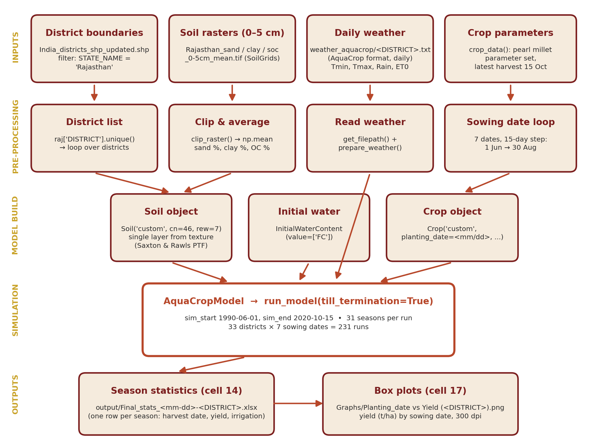

# Pearl millet yield simulation for Rajasthan districts (AquaCrop-OSPy)

This repository simulates rainfed pearl millet (*kharif*) yield in all 33 districts of Rajasthan, India, with the [AquaCrop-OSPy](https://github.com/aquacropos/aquacrop) crop model. It tests **seven sowing dates** (1 June to 30 August, 15 days apart) over **31 seasons (1990–2020)**. The results show which sowing window gives the highest and most stable yield in each district.



## Contents

```
.
├── notebooks/
│   ├── 01_ET0_calculation.ipynb              NASA POWER daily data -> FAO-56 ET0 -> AquaCrop weather files
│   ├── 02_pearl_millet_yield_simulation.ipynb  soil + weather + crop -> 231 AquaCrop runs -> season statistics
│   ├── 03_compile_seasonal_data.ipynb        joins yields with seasonal rainfall, Tmin, Tmax, ET0
│   ├── 04_district_mean_cv.ipynb             district mean yield, CV and weather -> shapefiles for mapping
│   ├── 05_correlation_analysis.ipynb         correlation (Pearson, Spearman) of yield with weather
│   ├── 06_maps.ipynb                         maps of mean yield, CV and weather by sowing date
│   └── exploratory/RCP_pearl_millet.ipynb    unfinished test of RCP 4.5 / 8.5 weather (not used in the paper)
├── data/
│   ├── weather/            NASA POWER daily data per district (raw CSV)
│   ├── weather_aquacrop/   AquaCrop-format weather per district (output of notebook 01)
│   ├── soil/               SoilGrids layers clipped to Rajasthan (6 depths)
│   ├── location data/      district boundaries, centroids, and mapping shapefiles
│   ├── shape/              extra boundaries (Jodhpur district and blocks, map extract)
│   └── observed_yield/     observed district yields (DES and other sources)
├── docs/                   workflow document and diagram
├── output/   Graphs/   maps/   empty; filled when the notebooks run
├── environment.yml   requirements.txt
└── CITATION.cff   LICENSE
```

Data sources and licences are listed in [`data/README.md`](data/README.md).

## Setup

The code needs **AquaCrop-OSPy 2.2.3** on Python 3.9. Newer AquaCrop versions (3.x) changed the `Crop` class and renamed the yield column, so notebook 02 fails on them.

```bash
conda env create -f environment.yml
conda activate pm-aquacrop
jupyter lab
```

Or with pip in a Python 3.9 virtual environment: `pip install -r requirements.txt`.

**C compiler note.** On first import, AquaCrop 2.2.3 compiles its core modules, which takes about a minute and needs a C compiler. If there is no compiler (common on Windows), set this environment variable before starting Jupyter. The model then runs in just-in-time mode. It is slower, but the results are identical (checked for Ajmer, 1 June sowing).

```bash
set DEVELOPMENT=True        # Windows cmd
export DEVELOPMENT=True     # Linux / macOS
```

## How to run

Open the notebooks from the `notebooks/` folder and run them in order. All paths are relative to the repository root.

| Step | Notebook | Reads | Writes |
|---|---|---|---|
| 1 | `01_ET0_calculation` | `data/weather/*.csv` | `data/weather_aquacrop/*.txt` (already included) |
| 2 | `02_pearl_millet_yield_simulation` | weather, soil, district boundaries | `output/Final_stats_<mm-dd>-<DISTRICT>.xlsx` (231 files), `Graphs/*.png` |
| 3 | `03_compile_seasonal_data` | `output/Final_stats_*` | `output/compiled data.xlsx` |
| 4 | `04_district_mean_cv` | `output/Final_stats_*` | `data/location data/Rajasthan_PM_{mean,CV,weather}.shp` |
| 5 | `05_correlation_analysis` | `output/compiled data.xlsx` | tables in the notebook |
| 6 | `06_maps` | `data/location data/Rajasthan_PM_*.shp` | `maps/*.png` |

Step 1 is optional because its output is already in `data/weather_aquacrop/`. Re-running it gives identical files. Step 2 runs 231 simulations and takes the longest.

## Model set-up (summary)

- **Weather:** NASA POWER daily Tmin, Tmax and rainfall at each district centroid. Reference ET0 was calculated with the FAO-56 Penman–Monteith method (`eto` package), using radiation, humidity and wind.
- **Soil:** SoilGrids sand, clay and organic carbon (0–5 cm), averaged over each district. They were converted to hydraulic properties with AquaCrop's Saxton & Rawls pedotransfer functions. Curve number 46, readily evaporable water 7 mm. The profile starts at field capacity.
- **Crop:** calendar-day pearl millet parameters: maturity 105 days, reference harvest index 0.27, water productivity 14 g m⁻², 55,556 plants ha⁻¹. Rainfed, with a latest harvest date of 15 October.
- **Design:** 33 districts × 7 sowing dates × 31 seasons = 7,161 simulated seasons.

The full step-by-step description and parameter table are in [`docs/Pearl_Millet_AquaCrop_Workflow.docx`](docs/Pearl_Millet_AquaCrop_Workflow.docx).

## Reproducibility check

With the pinned environment, notebook 02 gives a mean yield of **3.12 t ha⁻¹** for Ajmer, 1 June sowing, the same as the published table.

## Known limitations

These are documented in the code as it was used for the paper and have not been changed:

1. The soil rasters have no nodata value. `np.mean` after clipping also averages the zero-filled pixels outside each district, which biases sand, clay and organic carbon low.
2. The fixed latest harvest date (15 October) ends the season before maturity for sowings after 1 July. Part of the yield decline for late sowing is caused by this cut-off.
3. Soil organic carbon is passed to AquaCrop as organic matter, without the ×1.724 conversion.
4. Only the 0–5 cm soil layer is used, for the whole profile.


## Citation

See [`CITATION.cff`](CITATION.cff). GitHub shows a "Cite this repository" button once the repository is published.

## Licence

Code: MIT (see [`LICENSE`](LICENSE)). Data keep the licences of their original sources (see [`data/README.md`](data/README.md)).
